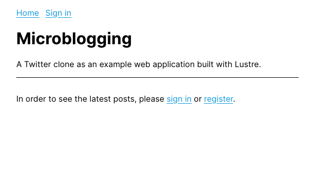
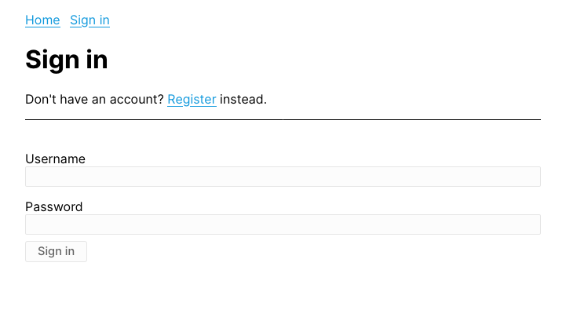
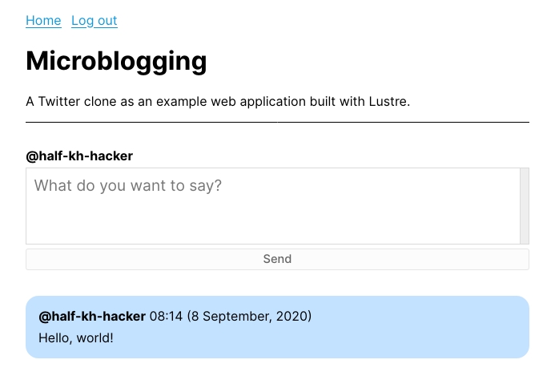
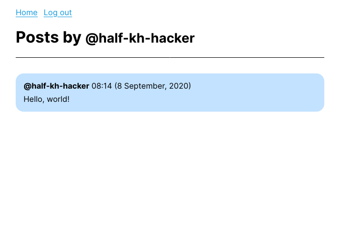

# Microblogging

A Twitter clone as an example web application built with Lustre.

## Usage

```shell
$ pipenv install && pipenv shell
[pipenv] $ ./init_db.py
[pipenv] $ ./run_dev.py
```

## Screenshots

<center>









</center>
